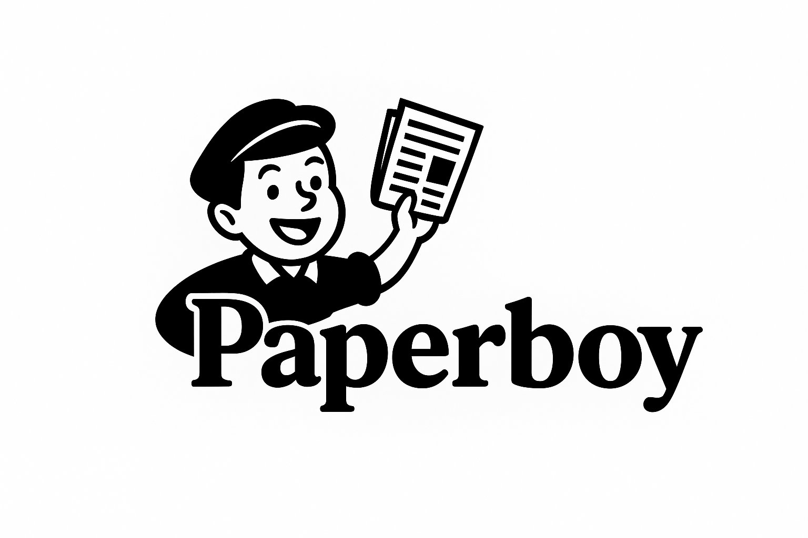

# Paperboy Newsstand Daily

A modern web application built with React, TypeScript, and Supabase.

## Project Overview

This project is a newsstand application that allows users to browse and read daily news articles. It features a modern UI built with shadcn/ui components and is powered by Supabase for backend functionality.

## Technologies Used

- **Frontend Framework**: React 18 with TypeScript
- **Build Tool**: Vite
- **Styling**: Tailwind CSS with shadcn/ui components
- **Backend**: Supabase
- **State Management**: React Query (TanStack Query)
- **Routing**: React Router DOM
- **Form Handling**: React Hook Form with Zod validation
- **UI Components**: Radix UI primitives
- **Animations**: Framer Motion
- **Charts**: Recharts
- **Date Handling**: date-fns

## Getting Started

### Prerequisites

- Node.js (Latest LTS version recommended)
- npm or bun package manager

### Installation

1. Clone the repository:

```sh
git clone <repository-url>
cd paperboy-newsstand-daily
```

2. Install dependencies:

```sh
npm install
# or if using bun
bun install
```

3. Start the development server:

```sh
npm run dev
# or
bun run dev
```

The application will be available at `http://localhost:5173`

## Available Scripts

- `npm run dev` - Start development server
- `npm run build` - Build for production
- `npm run build:dev` - Build for development
- `npm run lint` - Run ESLint
- `npm run preview` - Preview production build

## Project Structure

- `/src` - Source code
- `/public` - Static assets
- `/supabase` - Supabase configuration and migrations
- `/components` - Reusable UI components
- `/styles` - Global styles and Tailwind configuration

## Development

The project uses ESLint for code linting and TypeScript for type checking. Make sure to run the linter before committing changes:

```sh
npm run lint
```

## Contributing

1. Create a new branch for your feature
2. Make your changes
3. Submit a pull request

## License

[Add your license information here]
